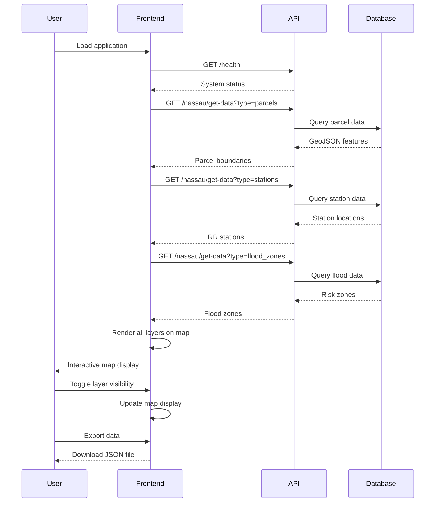

# 🏙️ Sustainable Urban Studio - Application Architecture

## 📊 System Overview

The Sustainable Urban Studio is a comprehensive GIS-enabled urban planning platform built with React, TypeScript, and modern mapping technologies. It integrates real-time data from multiple sources to provide urban planners with actionable insights for sustainable development.

## 🏗️ Architecture Diagram

```
┌─────────────────────────────────────────────────────────────────────────────────┐
│                            Frontend - React Application                          │
├─────────────────────────────────────────────────────────────────────────────────┤
│  ┌─────────────┐  ┌──────────────────┐  ┌─────────────────┐  ┌────────────────┐ │
│  │   App.tsx   │  │ EnhancedLeaflet  │  │   Data Panels   │  │ Layer Controls │ │
│  │ (Main Shell)│◄─┤   Viewer.tsx     │◄─┤   & Statistics │◄─┤   & Settings  │ │
│  └─────────────┘  │  (Map Engine)    │  └─────────────────┘  └────────────────┘ │
│                   └──────────────────┘                                           │
├─────────────────────────────────────────────────────────────────────────────────┤
│                             External Dependencies                                │
│  ┌─────────────┐  ┌──────────────────┐  ┌─────────────────┐  ┌────────────────┐ │
│  │  Leaflet.js │  │   OpenStreetMap  │  │  ArcGIS Tiles   │  │   Lucide Icons │ │
│  │  (Mapping)  │  │     (Tiles)      │  │   (Satellite)   │  │   (UI Icons)   │ │
│  └─────────────┘  └──────────────────┘  └─────────────────┘  └────────────────┘ │
└─────────────────────────────────────────────────────────────────────────────────┘
                                      ↕ HTTP/JSON
┌─────────────────────────────────────────────────────────────────────────────────┐
│                          Backend APIs (localhost:3001)                          │
├─────────────────────────────────────────────────────────────────────────────────┤
│  ┌─────────────┐  ┌──────────────────┐  ┌─────────────────┐  ┌────────────────┐ │
│  │ QGIS Data   │  │  FEMA Sea Level  │  │  File Upload    │  │  Health Check  │ │
│  │   Service   │  │   Rise Service   │  │    Service      │  │    Service     │ │
│  └─────────────┘  └──────────────────┘  └─────────────────┘  └────────────────┘ │
└─────────────────────────────────────────────────────────────────────────────────┘
                                      ↕
┌─────────────────────────────────────────────────────────────────────────────────┐
│                              Data Sources                                        │
├─────────────────────────────────────────────────────────────────────────────────┤
│  ┌─────────────┐  ┌──────────────────┐  ┌─────────────────┐  ┌────────────────┐ │
│  │ Nassau GIS  │  │   FEMA Risk      │  │  Elevation      │  │  Census Data   │ │
│  │  Database   │  │     Data         │  │    Models       │  │   (Future)     │ │
│  └─────────────┘  └──────────────────┘  └─────────────────┘  └────────────────┘ │
└─────────────────────────────────────────────────────────────────────────────────┘
```

## 🔌 API Endpoints

### Core QGIS Data Service
**Base URL:** `http://localhost:3001/api/qgis/`

| Endpoint | Method | Description | Response |
|----------|--------|-------------|----------|
| `/health` | GET | System health check | `{"status": "ok", "timestamp": "ISO-date"}` |
| `/nassau/get-data?type=parcels` | GET | Property parcel boundaries | GeoJSON FeatureCollection |
| `/nassau/get-data?type=stations` | GET | LIRR transit stations | GeoJSON FeatureCollection |
| `/nassau/get-data?type=flood_zones` | GET | FEMA flood risk zones | GeoJSON FeatureCollection |

### FEMA Sea Level Rise Service
**Base URL:** `http://localhost:3001/api/gis/fema-sea-level-rise/`

| Endpoint | Method | Description | Response |
|----------|--------|-------------|----------|
| `/scenarios` | GET | Available projection scenarios | `{"scenarios": ["2030", "2050", "2100"]}` |
| `/data?lat={lat}&lng={lng}&scenario={scenario}` | GET | Location-specific risk analysis | Risk assessment JSON |

### File Management Service
**Base URL:** `http://localhost:3001/api/`

| Endpoint | Method | Description | Response |
|----------|--------|-------------|----------|
| `/upload` | POST | Upload GIS files | Upload confirmation |
| `/files` | GET | List uploaded files | File inventory |

## 🗺️ Map Engine: Enhanced Leaflet Capabilities

### Base Layer Options
1. **OpenStreetMap** - Standard street map
2. **Satellite** - Esri World Imagery
3. **Terrain** - OpenTopoMap
4. **Dark** - Stadia dark theme

### Advanced Features
- **Dynamic Layer Toggle** - Real-time show/hide GIS layers
- **Interactive Popups** - Detailed feature information
- **Hover Effects** - Visual feedback on map interactions
- **Export Functionality** - Download GIS data as JSON
- **Custom Markers** - Styled icons for different data types
- **Progressive Loading** - Async data loading with fallbacks

### Styling Capabilities
```css
/* Custom marker styling */
.custom-marker {
  width: 32px;
  height: 32px;
  border-radius: 50%;
  box-shadow: 0 4px 12px rgba(0, 0, 0, 0.3);
  border: 2px solid white;
  transition: all 0.2s ease;
}

.custom-marker:hover {
  transform: scale(1.1);
  box-shadow: 0 6px 20px rgba(0, 0, 0, 0.4);
}
```

### GIS Layer Styling
- **Property Parcels**: Blue polygons with hover effects
- **LIRR Stations**: Train emoji markers with info popups
- **Flood Zones**: Color-coded by risk level (red=high, green=low)

## 📊 Data Flow



## 🛠️ Technology Stack

### Frontend
- **React 18** - UI framework
- **TypeScript** - Type safety
- **Tailwind CSS** - Utility-first styling
- **Leaflet** - Interactive maps
- **Lucide React** - Icon library
- **Vite** - Build tool

### Mapping & GIS
- **Leaflet.js** - Primary mapping library
- **OpenStreetMap** - Base map tiles
- **Esri ArcGIS** - Satellite imagery
- **GeoJSON** - Geographic data format

### Development Tools
- **ESLint** - Code linting
- **PostCSS** - CSS processing
- **npm** - Package management

## 🔧 Key Components

### 1. App.tsx (Main Application)
- Application shell and layout
- GIS data fetching and state management
- Error handling and loading states
- Data panel integration

### 2. EnhancedLeafletViewer.tsx (Map Engine)
- Leaflet map initialization
- Layer management system
- Interactive controls
- Data visualization
- Export functionality

### 3. Data Processing Pipeline
```typescript
interface GISData {
  parcels: GeoJSON.FeatureCollection;
  stations: GeoJSON.FeatureCollection;
  flood_zones: GeoJSON.FeatureCollection;
}

interface LayerConfig {
  key: string;
  label: string;
  icon: string;
  color: string;
  visible: boolean;
}
```

## 🚀 Performance Optimizations

1. **Lazy Loading** - Components load only when needed
2. **Mock Data Fallbacks** - Graceful degradation when APIs are unavailable
3. **Canvas Rendering** - Leaflet preferCanvas option for better performance
4. **Efficient Re-renders** - React state optimization

## 🎨 UI/UX Features

### Design System
- **Dark/Light Themes** - Support for both modes
- **Responsive Layout** - Mobile and desktop optimization
- **Accessibility** - ARIA labels and keyboard navigation
- **Professional Styling** - Modern, clean interface

### Interactive Elements
- **Hover States** - Visual feedback on all interactive elements
- **Loading Indicators** - Clear progress feedback
- **Error States** - Helpful error messages with retry options
- **Success States** - Confirmation of user actions

## 📈 Future Enhancements

### Planned Features
1. **3D Visualization** - Deck.gl integration
2. **Real-time Updates** - WebSocket connections
3. **Advanced Analytics** - Chart.js dashboards
4. **User Authentication** - Multi-user support
5. **Data Sharing** - Export to multiple formats

### API Expansions
1. **Weather Integration** - Climate data overlay
2. **Traffic Patterns** - Real-time transportation data
3. **Economic Indicators** - Development impact metrics
4. **Environmental Sensors** - Air quality monitoring

## 🔒 Security Considerations

- **API Rate Limiting** - Prevent abuse
- **Data Validation** - Input sanitization
- **CORS Configuration** - Secure cross-origin requests
- **Environment Variables** - Secure configuration management

## 📱 Browser Support

- **Chrome** 90+ ✅
- **Firefox** 88+ ✅
- **Safari** 14+ ✅
- **Edge** 90+ ✅

## 🧪 Testing Strategy

- **Unit Tests** - Component isolation testing
- **Integration Tests** - API interaction testing
- **E2E Tests** - Full user workflow testing
- **Performance Tests** - Load and stress testing

---

*This architecture documentation is maintained alongside the codebase and should be updated with any significant changes to the system design.*