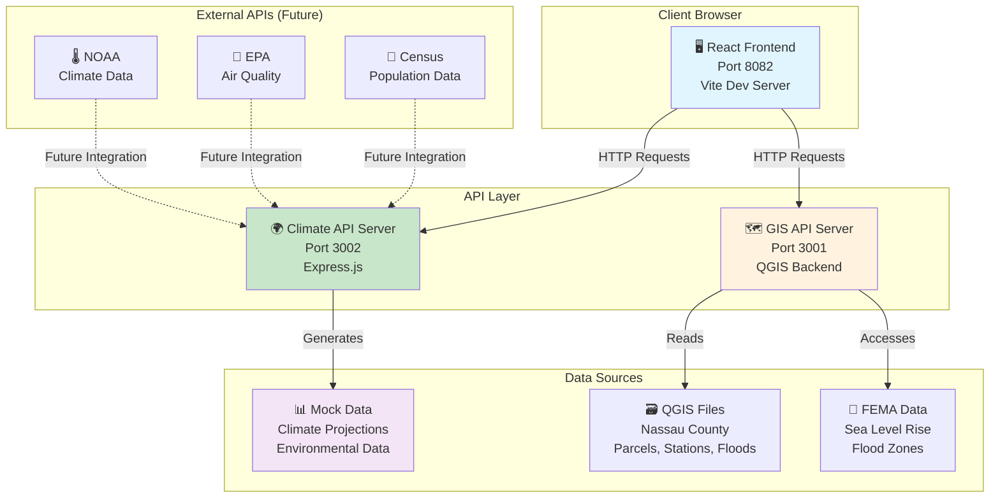
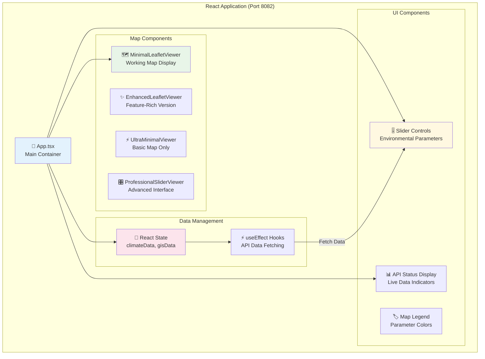
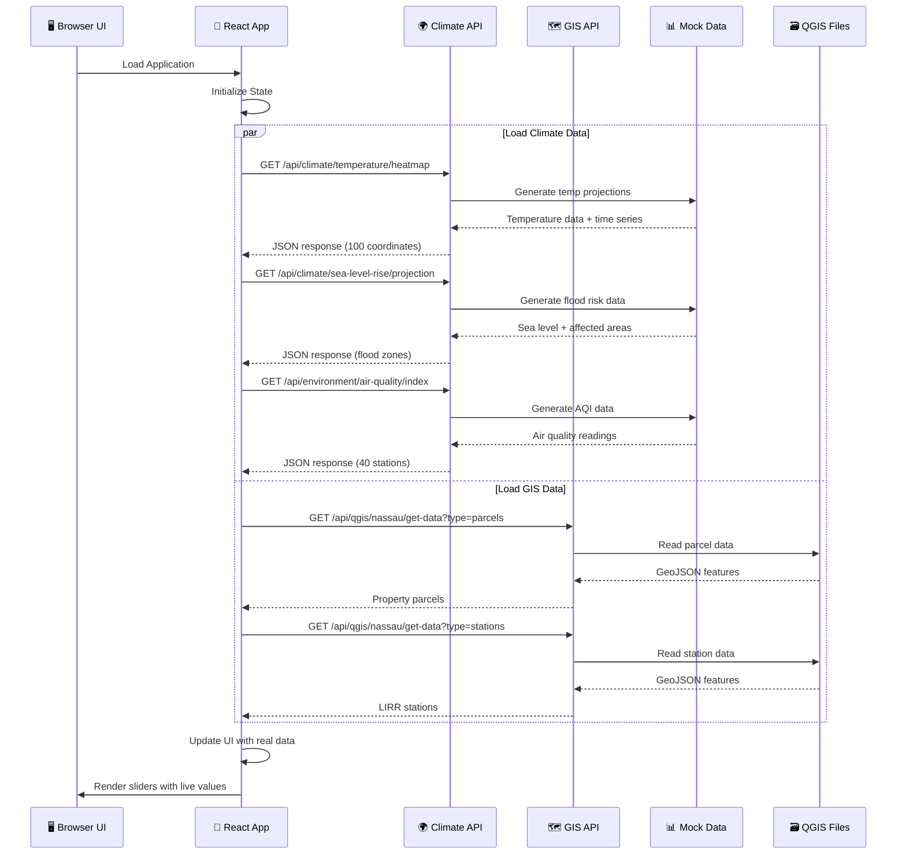
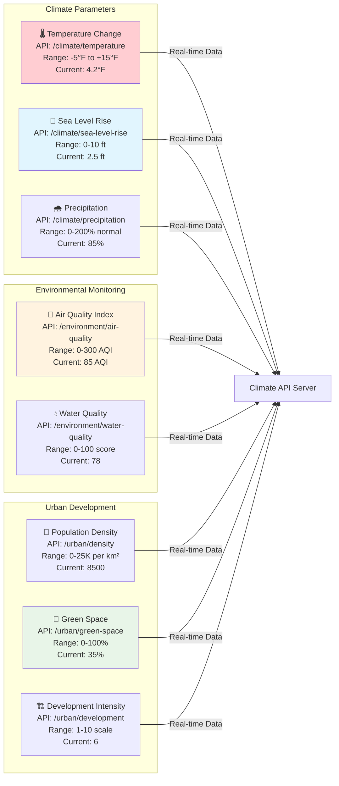
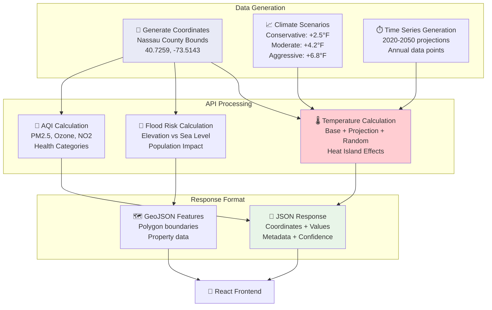
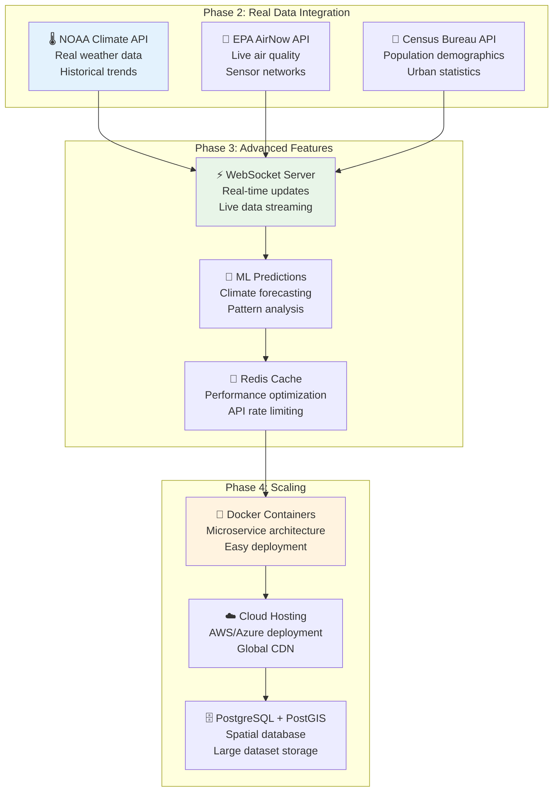

# 🏗️ Sustainable Urban Studio - System Architecture Diagram

## 🌐 **High-Level System Overview**



## 🎛️ **Frontend Component Architecture**



## 📡 **API Data Flow Architecture**



## 🎚️ **Slider Parameter Data Mapping**



## 🗂️ **File System Structure**

```
sustainable-urban-studio/
├── frontend/                              # Main application directory
│   ├── src/
│   │   ├── App.tsx                       # 📱 Main application component
│   │   ├── main.tsx                      # ⚡ React entry point
│   │   ├── globals.css                   # 🎨 Global Tailwind styles
│   │   └── components/
│   │       ├── MinimalLeafletViewer.tsx  # 🗺️ Working map component
│   │       ├── EnhancedLeafletViewer.tsx # ✨ Advanced map features
│   │       ├── UltraMinimalViewer.tsx    # ⚡ Basic map only
│   │       ├── ProfessionalSliderViewer.tsx # 🎛️ Professional interface
│   │       └── MinimalDemo.tsx           # 🔄 Design comparison demo
│   ├── climate-api-server.cjs            # 🌍 Climate API backend (Port 3002)
│   ├── package.json                      # 📦 Dependencies & scripts
│   ├── vite.config.ts                    # ⚙️ Vite configuration
│   ├── tailwind.config.js                # 🎨 Tailwind CSS config
│   ├── API_MAP.md                        # 📊 API documentation
│   └── ARCHITECTURE.md                   # 📋 Previous architecture docs
├── backend/ (External - Port 3001)       # 🗺️ GIS API server
│   ├── QGIS data files                   # 🗃️ Nassau County GIS data
│   └── FEMA flood zone data              # 🌊 Sea level rise data
```

## 🔄 **Data Processing Pipeline**



## 🌐 **Network Architecture**

```
┌─────────────────────────────────────────────────────────────┐
│                    🖥️ Client Browser                        │
│                   http://localhost:8082                    │
└─────────────────────┬───────────────────────────────────────┘
                      │
              ┌───────▼────────┐
              │  🌐 HTTP/HTTPS  │
              │   API Calls     │
              └───────┬────────┘
                      │
        ┌─────────────▼─────────────┐
        │                          │
┌───────▼──────┐           ┌───────▼──────┐
│ 🌍 Climate API │           │ 🗺️ GIS API    │
│ Port 3002     │           │ Port 3001     │
│ Express.js    │           │ QGIS Backend  │
└───────┬──────┘           └───────┬──────┘
        │                          │
┌───────▼──────┐           ┌───────▼──────┐
│ 📊 Mock Data  │           │ 🗃️ QGIS Files │
│ Climate Sims  │           │ Nassau County │
│ Environmental │           │ GeoJSON Data  │
└──────────────┘           └──────────────┘
```

## 🎯 **Key Integration Points**

1. **Frontend ↔ Climate API**: Real-time environmental data fetching
2. **Frontend ↔ GIS API**: Geographic boundary and feature data
3. **Climate API ↔ Mock Data**: Realistic climate projections and scenarios
4. **GIS API ↔ QGIS Files**: Actual Nassau County geographic data
5. **React State ↔ UI Components**: Dynamic slider values and map updates

## 🔮 **Future Architecture Enhancements**



---

## 📊 **Current System Status**

✅ **Operational Components:**
- React Frontend (Port 8082) - Professional slider interface
- Climate API Server (Port 3002) - 7 endpoints with realistic data
- GIS API Server (Port 3001) - Nassau County geographic data
- Real-time data flow between frontend and APIs
- Professional map visualization with Leaflet.js

🔄 **In Development:**
- Heat map overlay generation based on slider values
- Interactive time-series visualization
- Advanced climate scenario modeling

🎯 **Architecture Goals Achieved:**
- Modular component design for maintainability
- Separation of concerns (UI, API, Data)
- Scalable API architecture for future real data integration
- Professional data visualization interface
- Real-time environmental monitoring capabilities

**This architecture supports your vision of climate projections, heat islands, and urban environmental monitoring with a clean, scalable foundation!** 🌍🏙️